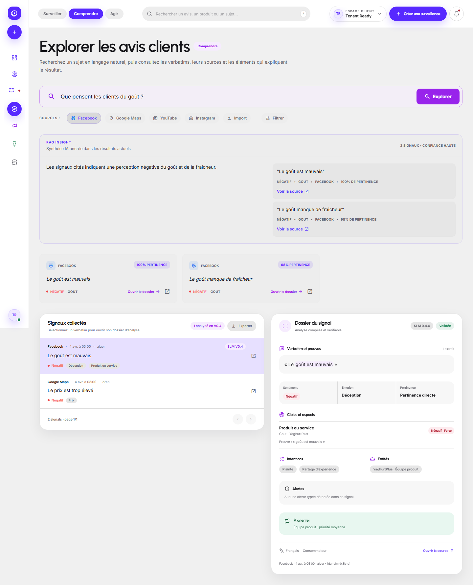
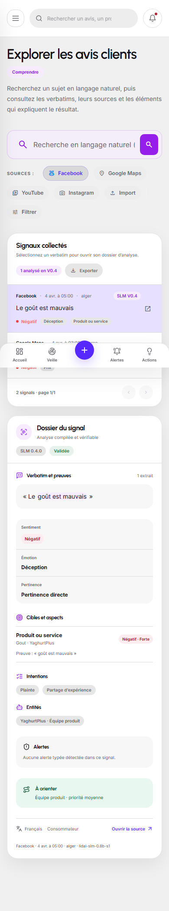
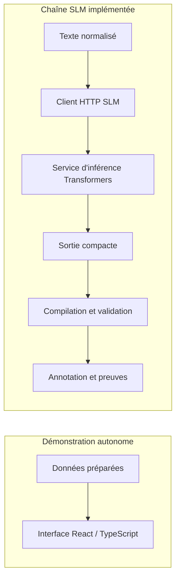

<p align="center">
  
</p>

# LIDALPulse

**Surveiller les avis. Comprendre les signaux. Préparer une décision.**

LIDALPulse est un prototype de veille et d'analyse des retours clients pour les marques algériennes. Il réunit une interface React/TypeScript, des services Python/FastAPI et une chaîne d'analyse multilingue avec SLM spécialisé.

Le parcours produit relie **surveillance → signal → preuve → action humaine**. La démonstration autonome utilise des données préparées ; le dépôt contient également le code de chargement et d'inférence du SLM.

## Aperçu du produit



*Capture existante de l'Explorateur V3 avec réponses simulées et données de test. Les badges SLM et scores affichés illustrent le contrat de l'interface ; ils ne mesurent pas une inférence en direct. L'identité visuelle a évolué depuis cette capture.*

<details>
<summary>Voir la version mobile</summary>



*Même scénario de test, adapté à un écran mobile.*

</details>

## Fonctionnalités

| Parcours | Ce que le prototype permet d'explorer |
| --- | --- |
| Surveiller | Définir un périmètre de veille et consulter les sources et signaux. |
| Comprendre | Rechercher des avis, lire leurs preuves et consulter sentiment, aspects et intentions. |
| Agir | Relier un signal à un dossier et à une action vérifiée par une personne. |
| Points d'écoute | Tester des formulaires de retour et un parcours QR dans la démonstration locale. |

Les scénarios de démonstration présentent notamment Facebook, Google Maps, YouTube, un audio autorisé et un formulaire QR. Leur présence dans l'interface ne garantit pas qu'un connecteur collecte des données en direct.

## Démarrer la démonstration

La branche **`main`** contient la version LIDALPulse retenue. **`legacy-main`** conserve l'ancienne base RamyPulse.

Sur Windows, avec Git et **Node.js 20.19+ ou 22.12+** :

```powershell
git clone --branch main https://github.com/rayantr06/LIDALPulse.git
cd LIDALPulse
powershell -ExecutionPolicy Bypass -File .\scripts\leticia\INSTALLER_DEMO_LETICIA.ps1
powershell -ExecutionPolicy Bypass -File .\scripts\leticia\LANCER_DEMO_LETICIA.ps1
```

La démonstration s'ouvre sur `http://127.0.0.1:5173/#/`. Elle ne demande ni serveur Python ni clé fournisseur. Le script d'installation conserve un fichier d'environnement local déjà présent.

- [Installation Windows et prérequis](docs/protomarket_ii_2026/demo_leticia/01_INSTALLATION_WINDOWS.md)
- [Parcours de démonstration du prototype](docs/protomarket_ii_2026/demo_leticia/02_SCRIPT_VIDEO_PROTOTYPE.md)
- [Réinitialisation, contrôles et préparation](docs/protomarket_ii_2026/demo_leticia/04_CHECKLIST_AVANT_TOURNAGE.md)
- [Dépannage rapide](docs/protomarket_ii_2026/demo_leticia/05_DEPANNAGE_RAPIDE.md)

Les scripts de captation décrivent un parcours à enregistrer ; ils ne constituent pas une vidéo déjà publiée.

## Architecture et stack

| Couche | Technologies et rôle |
| --- | --- |
| Interface | React 18, TypeScript, Vite, TanStack Query, Tailwind CSS et composants Radix/shadcn. |
| Services applicatifs | Python/FastAPI ; API historique et service V3 distinct. SQLite pour les données locales/pilotes. |
| Analyse | Normalisation, recherche de preuves, client HTTP SLM et compilation d'annotations structurées. |
| Inférence SLM | PyTorch et Hugging Face Transformers ; chargement d'un checkpoint configurable. |
| Vérification | Tests Python, contrats frontend et parcours Playwright avec données préparées. |



Le service [`inference/slm_v04_service.py`](inference/slm_v04_service.py) charge tokenizer et modèle avec `from_pretrained`, puis appelle `model.generate`. Le [client HTTP](core/analysis/slm_v04_client.py) et le [compilateur](core/analysis/slm_v04_compiler.py) relient cette sortie au pipeline de normalisation.

`SLM_V04_ENABLED` est désactivé par défaut. L'inférence nécessite un checkpoint accessible, les dépendances adéquates et la configuration du service. Cette démonstration ne prouve pas que le SLM est actuellement chargé ou déployé.

- [Exécution du service V3 et configuration serveur](docs/v3/RUNBOOK.md)
- [Contrat d'intégration SLM/application](docs/slm_v2/CONTRAT_INTEGRATION_APP_V3_2026-08-17.md)
- [État de l'implémentation V3 et travaux restants](docs/v3/IMPLEMENTATION_STATUS.md)

## Statut du projet

LIDAL Pulse est en cours de développement. Le dépôt présente l’interface, les outils d’analyse et l’intégration du SLM. La démonstration utilise des données synthétiques ; l’exécution du modèle nécessite un checkpoint configuré séparément.
